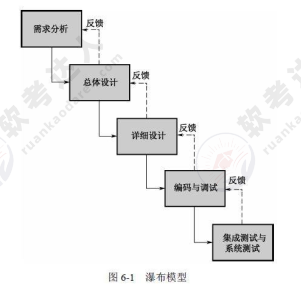
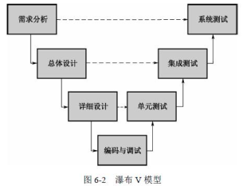
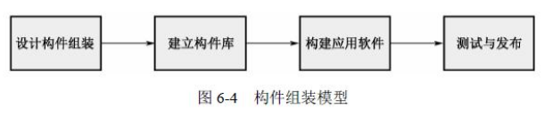
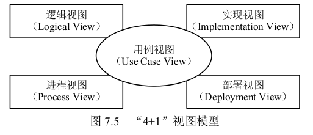

mm# 5。系统性能评价
## 性能指标
### 对`计算机`评价的主要性能指标
- **时钟频率**
- **高速缓存**
- **运算速度**
> 其单位一般用 `MIPS` (百万条指令/秒)和 `MFLOPS` (百万次浮点运算/秒)。
> - `MIPS` 用于描述计算机的定点运算能力; 
> - `MFLOPS` 则用来表示计算机的浮点运算能力
- **运算精度**
> 也就是计算机的处理的二进制位数，例如32位、64位。位数越多性能也就越强。
- **内存的存储容量**
> 内存的容量越大，可存储的数据和程序就越多，从而减少与磁盘信息交换的次数，使运行效率得到提高
- **存储器的存取周期**
> 内存完成一次读(取)或写(存)操作所需的时间称为存储器的存取时间或者访问时间。而连续两次读(或写)所需的最短时间称为存储周期。存储周期越短，表示从内存存取信息的时间越短，系统的性能也就越好。
- **数据处理速率**
- **响应时间**
- **RASIS 特性**
> RASIS 特性是**可靠性**(Reliability)、**可用性**(Availability)、**可维护性**(Serviceability)、**完整性**(Integraity)和**安全性**(Security)五者的统称。
> 
> 可靠性是指计算机系统在规定的工作条件下和规定的工作时间内持续正确运行的概率。可靠性一般是用平均无故障时间(Mean Time To Failure，**MTTF**)或平均故障间隔时间(Mean Time Between Failure，**MTBF**)来衡量。可维护性是指系统发生故障后能尽快修复的能力，一般用平均故障修复时间(Mean Time To Repair，**MTTR**)来表示。取决于维护人员的技术水平和对系统的熟悉程度，同时和系统的可维护性也密切相关。

- **平均故障响应时间**
> 平均故障响应时间(TAT)即从出现故障到该故障得到确认修复前的这段时间。该指标反应的是服务水平。平均故障响应时间越短，对用户系统的影响越小。

- **兼容性**

### 对`网络`评价的主要性能指标
- **带宽**
- **时延**
- **丢包率**
- **吞吐量**

### 对`操作系统`评价的主要性能指标
- **系统的可靠性**
- **系统的吞吐量**
- **系统响应时间**
- **系统资源利用率**
- **系统的可移植性**

### 对`数据库`评价的主要性能指标
数据库和数据库管理系统的性能指标包括以下几个方面:
- **数据库的大小**
- **单个数据库文件的大小**
- **数据库中表的数量**
- **表上所允许的索引数量**
- **数据库所允许的索引数量**
- **最大并发事务处理能力**
- **最大连接数**

### 对`web服务器`评价的主要性能指标

Web 服务器的主要性能指标包括
- **最大并发连接数**
- **响应延迟**
- **吞吐量(每秒处理的请求数)**
- 成功请求数
- 失败请求数
- 每秒点击次数
- 每秒成功点击次数
- 每秒失败点击次数
- 尝试连接数
- 用户连接数

>[!TIP]
>
> 一般常考`计算机`和`web服务器`的性能指标；例如`计算机`的*RASIS*特性和`web服务器`的最大并发连接数、响应延迟、吞吐量等。

## 性能计算

性能指标计算的主要方法有:*定义法*、*公式法*、*程序检测法*、*仪器检测法*。

- 定义法主要根据其定义直接获取其理想数据；

- 公式法则一般适用于根据基本定义所衍生出的复合性能指标的计算；

- 程序检测法和仪器检测法则是通过实际的测试来得到其实际值(由于测试的环境和条件不定，其结果也可能相差比较大)。

## 性能设计

### 阿姆达尔的解决方案

### 负载均衡

当用户发现 Web 站点负载量非常大时，应当考虑使用负载均衡技术来将负载平均分摊到多个内部服务器上。

具体的实现方法有:

- 基于特定服务器软件的负载均衡
> 主要是利用 HTTP 协议的"重定向"功能来实现的，也就是 Location 指令。
- 基于 DNS 的负载均衡
> 在 DNS 服务器中，可以为多个不同的地址配置同一个名字，而最终查询这个名字的客户机将在解析这个名字时得到其中一个地址。
- 反向代理负载均衡
- 基于　NAT (网络地址转换)的负载均衡
> 地址转换可以通过软件方式来实现，也可以通过硬件方式来实现。

## 性能评估

性能评估是对一个系统进行各项检测，并形成一份直观的文档，因此性能评估是通过各项测试来完成的。

### 基准测试程序

**把应用程序中用得最多、最频繁的那部分核心程序作为评价计算机性能的标准程序。称为基准测试程序(benchmark)。**

大多数情况下，为测试新系统的性能，用户必须依靠评价程序来评价机器的性能。下面列出了4种评价程序，它们评测的准确程度依次递减：<mark>真实的程序</mark>、<mark>核心程序</mark>、<mark>小型基准程序</mark>、<mark>合成基准程序</mark>。

>[!TIP]
>
> 很常考！！！

常见的基准测试方案有：
- 整数测试程序: Dhrystone
- 浮点测试程序: Linpack
- Whetstone 基准测试程序
- SPEC 基准测试程序
- TPC 基准程序

### Web 服务器的性能评估

在 Web 服务器的测试中，能够反映其性能的主要包括**最大并发连接数**、**响应延迟**和**吞吐量**(每秒处理的请求数)几个参数。

现在常见的 Web 服务器性能评测方法有**基准性能测试**、**压力测试**和**可靠性测试**。

>[!TIP]
>
> 很常考！！！

### 系统监视

系统监视的目标是为了评估系统性能。要监视系统性能，需要收集某个时间段内的 3 种不同类型的性能数据:

1。常规性能数据

2。比较基准的性能数据

3。服务水平报告数据

# 6 开发方法

本章将介绍软件生命周期、软件开发模型、软件重用技术、逆向工程及形式化开发方法

## 6.1 软件生命周期

软件生命周期划分为 8 个阶段:

- **可行性研究与计划**

通过可行性研究，如果确定该软件具有研发的必要，则将产生<mark>《可行性研究报告》</mark>和<mark>《软件开发计划》</mark>，并进入需求分析的阶段。

- 需求分析

- **概要设计**（外部设计）

外部设计又称为概要设计，其主要职能是设计各个部分的功能、接口、相互
如何关联。

- **详细设计** （内部设计）

内部设计又称为详细设计，其主要职能是设计具体一个模块的实现。
- 实现

实现过程包括<u>编码</u>和<u>单元测试</u>

- 集成测试

集成测试又称为*组装测试*

- 确认测试

当完成集成测试后，软件之间的接口方面的错误已经排除，这时需要验证软件是否同需求一致，是否达到了预期目标

- 使用和维护

在软件使用过程中，必须不断地对软件进行维护，修正软件中的缺陷，修改软件中已经不能适应最新情况的功能或者增加新的功能

## 6.2 软件开发模型
软件开发模型是对软件开发过程的一种描述，是对软件开发过程中所使用的方法和工具的一种描述。

### 6.2.1 瀑布模型 :star:

瀑布模型的一个重要特点: 软件开发的阶段划分是明确的，一个阶段到下一个阶段有明显的界线。在每个阶段结束后，都会有固定的文档或源程序流入下一阶段。

瀑布模型是<u>面向文档</u>的软件开发模型。

### 6.2.2 瀑布 V 模型 :star:

在瀑布模型的基础上做了修改， 更强调<u>测试</u>.

>[!WARNING]
>
> 瀑布模型的缺点：在瀑布模型中，**需求分析阶段**是一切活动的基础，设计、实现和验证活动都是从需求分析阶段的结果导出的。一旦需求分析的结果不完全正确，存在偏差，那么后续的活动只能放大这个偏差，在错误的道路上越走越远

### 6.2.3 演化模型 :star::star:

演化模型可以看做若干次瀑布模型的迭代，当完成一个瀑布模型后，重新进入下一个迭代周期，软件在这样的迭代过程中得以演化、完善。根据不同的迭代特点，演化模型可以演变为*螺旋模型*、*增量模型*和*原型法开发*。

### 6.2.4 螺旋模型 :star::star:

融合了多种模型(将瀑布模型和演化模型结合起来); 引入了<u>**风险分析**</u>。将软件开发分为多个阶段，每个阶段分为 4 步: 需求定义、风险分析、工程实现、评审。

### 6.2.5 增量模型 :star:

在系统的技术架构成熟、风险较低的时候,可以采用增量的方式进行系统开发。一次发布一点功能， 发布多次。策略: **增量发布**、**原型法**。

### 6.2.6 原型法 :star:

应用于需求分析阶段， 需求不明确， 构建简易系统。原型开发分两大类: *快速原型法(又称抛弃式原型法)*和*演化式原型法*。其中快速原型法是快速开发出一个原型，利用该原型获取用户需求，然后将该原型抛弃。而演化式原型法是将原型逐步进化为最终的目标系统。

### 6.2.7 构件组装模型(CBSD)

搭积木式开发，标准: CORBA/COM,DCOM,DOM+/EJB.

### 6.2.8 喷泉模型

面向对象

### 6.2.9 RAD

快速开发模型. VB/DELPHi. 结合了<u>瀑布模型</u>和<u>构件组装模型</u>. 通过使用基于构件的开发方法获得快速开发, 当<u>系统模块化程度较高时</u>, 适合用该模型.

### 6.2.10 统一过程(UP/RUP) :star::star::star:

RUP 的特点是<mark>用例驱动的</mark>、<mark>以架构为中心的</mark>、<mark>迭代和增量</mark>的软件开发过程

RUP 用“4+1”视图模型来描述架构:

**逻辑视图**: 对应*最终用户*,<u>逻辑视图常用类图、对象图、状态图、协作图</u>表示。

**实现视图**: 又称为开发视图,对应*程序员*,该视图通常包含<u>包图和组件图</u>。

**进程视图**: 又叫过程视图,对应*系统集成人员*,<u>进程视图常用活动图表示</u>。

**部署视图**: 又叫物理视图,对应*系统工程师*。<u>部署视图常用部署图表示</u>。

**用例视图**: 所有其他视图都依靠用例视图(场景)来指导它们,这就是将模型称为"4+1"的原因

---
开发步骤：(4 个步骤)

🔶 **初始**: 确定项目范围和边界/识别系统的关键用例/展示系统的候选架构/估计项目费用和时间/评估项目风险

🔶 **细化**: 分析系统问题领域/<u>*建立软件架构基础*</u>/淘汰最高风险元素

🔶 **构建**: 开发剩余的构件/构件组装与测试

🔶 **交付**: 进行 B 测试/ 制作发布版本/用户文档定稿/确认新系统/培训、调整产品

### 6.2.11 敏捷开发 :star:

敏捷方法以原型开发思想为基础,采用迭代增量式开发,发行版本小型化,比较适合需求变化较大或者开发前期对需求不是很清晰的项目。面向对象。

## 6.3 逆向工程

逆向工程就是分析已有的程序,寻求比源代码更高级的抽象表现形式。一般认为,凡是在软件生命周期内将软件某种形式的描述转换成更为抽象形式的活动都可称为逆向工程。

## 6.4 再工程 (re-engineering)

也称修复和改造工程,它是在逆向工程所获信息的基础上修改或重构已有的系统,产生系统的一个新版本。

## 6.5 重构 (restructuring)

指在同一抽象级别上转换系统描述形式.

## 6.6 软件重用

软件重用(软件复用)是使用已有的软件产品(如设计、代码和文档等)来开发新的软件系统的过程。

- **水平式重用**

是重用不同应用领域中的软件元素,如*标准函数库*。

- **垂直式重用**

是在一类具有较多公共性的应用领域之间重用软件构件。

# 7 需求工程

需求工程包括需求管理和需求开发。

- **需求开发**

包括需求捕获、需求分析、编写规格说明书和需求验证 4 个阶段。需求开发更清晰、更明确地掌握客户对系统的需求。

- **需求管理**

通常包括定义需求基线、处理需求变更、需求跟踪等方面的工作。而需求管理则是对需求的变化进行管理的过程

# 8 系统分析与设计

## 8.1 结构化方法 (SASD)

结构化方法又称为面向功能的软件开发方法或面向数据流的软件开发方法。针对软件生存周期各个不同的阶段,有*结构化分析*、*结构化设计*和*结构化编程*等方法。

### 8.1.1 结构化分析 (SA) ⭐

SA 利用图形表达用户需求中的功能需求,使用的手段主要有<mark>数据流图(Data Flow Diagram,DFD)</mark>、<mark>数据字典</mark>、结构化语言、判定表以及判定树等。

数据流图(DFD)由 4 种基本元素组成:<u>数据流、处理/加工、数据存储和外部项</u>。

### 8.1.2 结构化设计 (SD) ⭐

SD 是一个**自顶向下**、**逐步求精**和**模块化**的过程。可分为两个阶段：

- **概要设计**: 主要任务是确定软件系统的结构,对系统进行模块划分,确定每个模块的功能、接口和模块之间的调用关系;

- **详细设计**: 主要任务是为每个模块设计实现的细节。

在 SD 中,**模块**是实现功能的基本单位,一般具有<u>功能、逻辑和状态</u> 3 个基本属性。模块分解中应遵循<u>"高内聚、低耦合"</u>的设计原则。

### 8.1.3 结构化编程 (SP)

SP 通过顺序、分支和循环三种基本的控制结构可以构造出任何单入口单出口的程序。

## 8.2 面向对象 (OO) ⭐⭐

主要考察 UML 图，待补充

# 9 系统测试 ⭐

测试是确保软件的质量,确认软件以正确的方式做了用户所期望的事情。

## 9.1 测试分类

- 根据程序执行状态分类

    `静态测试 (ST)`和`动态测试 (DT)`

- 根据关注具体实现和内部结构分类

    `白盒测试 (WT)`、`黑盒测试 (BT)`和`灰盒测试 (GT)`

- 根据执行方式分类

    `人工测试 (MT)`和`自动测试 (AT)`

- 根据测试的阶段分类

    `单元测试`、`集成测试`、`系统测试`和`验收测试`

>[!TIP]
>
> - `单元测试`主要是对该软件的模块进行测试,往往由程序员自己完成。常采用`白盒的静态测试`如静态分析、代码审查等,也可以采用自动化的动态测试。
> - `集成测试`对通过单元测试的模块进行组装测试,以验证组装的正确性,一般采用`白盒测试`和`黑盒测试`结合的方法。

# 10 静室软件工程 (CSE)

# 11 基于构件的软件工程 (CBSE) ⭐

常见的构件组装有**顺序组装**、**层次组装**和**叠加组装** 3 种组装方式。

构件组装可能面临接口不兼容的问题,常见的有**参数不兼容**、**操作不兼容**和**操作不完备** 3 种。这时需要编写<u>适配器构件</u>来解决不兼容的问题。

