mm# 5。系统性能评价
## 性能指标
### 对`计算机`评价的主要性能指标
- **时钟频率**
- **高速缓存**
- **运算速度**
> 其单位一般用 `MIPS` (百万条指令/秒)和 `MFLOPS` (百万次浮点运算/秒)。
> - `MIPS` 用于描述计算机的定点运算能力; 
> - `MFLOPS` 则用来表示计算机的浮点运算能力
- **运算精度**
> 也就是计算机的处理的二进制位数，例如32位、64位。位数越多性能也就越强。
- **内存的存储容量**
> 内存的容量越大，可存储的数据和程序就越多，从而减少与磁盘信息交换的次数，使运行效率得到提高
- **存储器的存取周期**
> 内存完成一次读(取)或写(存)操作所需的时间称为存储器的存取时间或者访问时间。而连续两次读(或写)所需的最短时间称为存储周期。存储周期越短，表示从内存存取信息的时间越短，系统的性能也就越好。
- **数据处理速率**
- **响应时间**
- **RASIS 特性**
> RASIS 特性是**可靠性**(Reliability)、**可用性**(Availability)、**可维护性**(Serviceability)、**完整性**(Integraity)和**安全性**(Security)五者的统称。
> 
> 可靠性是指计算机系统在规定的工作条件下和规定的工作时间内持续正确运行的概率。可靠性一般是用平均无故障时间(Mean Time To Failure，**MTTF**)或平均故障间隔时间(Mean Time Between Failure，**MTBF**)来衡量。可维护性是指系统发生故障后能尽快修复的能力，一般用平均故障修复时间(Mean Time To Repair，**MTTR**)来表示。取决于维护人员的技术水平和对系统的熟悉程度，同时和系统的可维护性也密切相关。

- **平均故障响应时间**
> 平均故障响应时间(TAT)即从出现故障到该故障得到确认修复前的这段时间。该指标反应的是服务水平。平均故障响应时间越短，对用户系统的影响越小。

- **兼容性**

### 对`网络`评价的主要性能指标
- **带宽**
- **时延**
- **丢包率**
- **吞吐量**

### 对`操作系统`评价的主要性能指标
- **系统的可靠性**
- **系统的吞吐量**
- **系统响应时间**
- **系统资源利用率**
- **系统的可移植性**

### 对`数据库`评价的主要性能指标
数据库和数据库管理系统的性能指标包括以下几个方面:
- **数据库的大小**
- **单个数据库文件的大小**
- **数据库中表的数量**
- **表上所允许的索引数量**
- **数据库所允许的索引数量**
- **最大并发事务处理能力**
- **最大连接数**

### 对`web服务器`评价的主要性能指标

Web 服务器的主要性能指标包括
- **最大并发连接数**
- **响应延迟**
- **吞吐量(每秒处理的请求数)**
- 成功请求数
- 失败请求数
- 每秒点击次数
- 每秒成功点击次数
- 每秒失败点击次数
- 尝试连接数
- 用户连接数

>[!TIP]
>
> 一般常考`计算机`和`web服务器`的性能指标；例如`计算机`的*RASIS*特性和`web服务器`的最大并发连接数、响应延迟、吞吐量等。

## 性能计算

性能指标计算的主要方法有:*定义法*、*公式法*、*程序检测法*、*仪器检测法*。

- 定义法主要根据其定义直接获取其理想数据；

- 公式法则一般适用于根据基本定义所衍生出的复合性能指标的计算；

- 程序检测法和仪器检测法则是通过实际的测试来得到其实际值(由于测试的环境和条件不定，其结果也可能相差比较大)。

## 性能设计

### 阿姆达尔的解决方案

### 负载均衡

当用户发现 Web 站点负载量非常大时，应当考虑使用负载均衡技术来将负载平均分摊到多个内部服务器上。

具体的实现方法有:

- 基于特定服务器软件的负载均衡
> 主要是利用 HTTP 协议的"重定向"功能来实现的，也就是 Location 指令。
- 基于 DNS 的负载均衡
> 在 DNS 服务器中，可以为多个不同的地址配置同一个名字，而最终查询这个名字的客户机将在解析这个名字时得到其中一个地址。
- 反向代理负载均衡
- 基于　NAT (网络地址转换)的负载均衡
> 地址转换可以通过软件方式来实现，也可以通过硬件方式来实现。

## 性能评估

性能评估是对一个系统进行各项检测，并形成一份直观的文档，因此性能评估是通过各项测试来完成的。

### 基准测试程序

**把应用程序中用得最多、最频繁的那部分核心程序作为评价计算机性能的标准程序。称为基准测试程序(benchmark)。**

大多数情况下，为测试新系统的性能，用户必须依靠评价程序来评价机器的性能。下面列出了4种评价程序，它们评测的准确程度依次递减：<mark>真实的程序</mark>、<mark>核心程序</mark>、<mark>小型基准程序</mark>、<mark>合成基准程序</mark>。

>[!TIP]
>
> 很常考！！！

常见的基准测试方案有：
- 整数测试程序: Dhrystone
- 浮点测试程序: Linpack
- Whetstone 基准测试程序
- SPEC 基准测试程序
- TPC 基准程序

### Web 服务器的性能评估

在 Web 服务器的测试中，能够反映其性能的主要包括**最大并发连接数**、**响应延迟**和**吞吐量**(每秒处理的请求数)几个参数。

现在常见的 Web 服务器性能评测方法有**基准性能测试**、**压力测试**和**可靠性测试**。

>[!TIP]
>
> 很常考！！！

### 系统监视

系统监视的目标是为了评估系统性能。要监视系统性能，需要收集某个时间段内的 3 种不同类型的性能数据:

1。常规性能数据

2。比较基准的性能数据

3。服务水平报告数据

# 6 开发方法

本章将介绍软件生命周期、软件开发模型、软件重用技术、逆向工程及形式化开发方法

## 6.1 软件生命周期

软件生命周期划分为 8 个阶段:

- **可行性研究与计划**

通过可行性研究，如果确定该软件具有研发的必要，则将产生<mark>《可行性研究报告》</mark>和<mark>《软件开发计划》</mark>，并进入需求分析的阶段。

- 需求分析

- **概要设计**（外部设计）

外部设计又称为概要设计，其主要职能是设计各个部分的功能、接口、相互
如何关联。

- **详细设计** （内部设计）

内部设计又称为详细设计，其主要职能是设计具体一个模块的实现。
- 实现

实现过程包括<u>编码</u>和<u>单元测试</u>

- 集成测试

集成测试又称为*组装测试*

- 确认测试

当完成集成测试后，软件之间的接口方面的错误已经排除，这时需要验证软件是否同需求一致，是否达到了预期目标

- 使用和维护

在软件使用过程中，必须不断地对软件进行维护，修正软件中的缺陷，修改软件中已经不能适应最新情况的功能或者增加新的功能

## 6.2 软件开发模型
软件开发模型是对软件开发过程的一种描述，是对软件开发过程中所使用的方法和工具的一种描述。

### 6.2.1 瀑布模型 :star:

瀑布模型的一个重要特点: 软件开发的阶段划分是明确的，一个阶段到下一个阶段有明显的界线。在每个阶段结束后，都会有固定的文档或源程序流入下一阶段。

瀑布模型是<u>面向文档</u>的软件开发模型。

### 6.2.2 瀑布 V 模型 :star:

在瀑布模型的基础上做了修改， 更强调<u>测试</u>.

>[!WARNING]
>
> 瀑布模型的缺点：在瀑布模型中，**需求分析阶段**是一切活动的基础，设计、实现和验证活动都是从需求分析阶段的结果导出的。一旦需求分析的结果不完全正确，存在偏差，那么后续的活动只能放大这个偏差，在错误的道路上越走越远

### 6.2.3 演化模型 :star::star:

演化模型可以看做若干次瀑布模型的迭代，当完成一个瀑布模型后，重新进入下一个迭代周期，软件在这样的迭代过程中得以演化、完善。根据不同的迭代特点，演化模型可以演变为*螺旋模型*、*增量模型*和*原型法开发*。

### 6.2.4 螺旋模型 :star::star:

融合了多种模型(将瀑布模型和演化模型结合起来); 引入了<u>**风险分析**</u>。将软件开发分为多个阶段，每个阶段分为 4 步: 需求定义、风险分析、工程实现、评审。

### 6.2.5 增量模型 :star:

在系统的技术架构成熟、风险较低的时候,可以采用增量的方式进行系统开发。一次发布一点功能， 发布多次。策略: **增量发布**、**原型法**。

### 6.2.6 原型法 :star:

应用于需求分析阶段， 需求不明确， 构建简易系统。原型开发分两大类: *快速原型法(又称抛弃式原型法)*和*演化式原型法*。其中快速原型法是快速开发出一个原型，利用该原型获取用户需求，然后将该原型抛弃。而演化式原型法是将原型逐步进化为最终的目标系统。

### 6.2.7 构件组装模型(CBSD)

搭积木式开发，标准: CORBA/COM,DCOM,DOM+/EJB.

### 6.2.8 喷泉模型

面向对象

### 6.2.9 RAD

快速开发模型. VB/DELPHi. 结合了<u>瀑布模型</u>和<u>构件组装模型</u>. 通过使用基于构件的开发方法获得快速开发, 当<u>系统模块化程度较高时</u>, 适合用该模型.

### 6.2.10 统一过程(UP/RUP) :star::star::star:

RUP 的特点是<mark>用例驱动的</mark>、<mark>以架构为中心的</mark>、<mark>迭代和增量</mark>的软件开发过程

RUP 用“4+1”视图模型来描述架构:

**逻辑视图**: 对应*最终用户*,<u>逻辑视图常用类图、对象图、状态图、协作图</u>表示。

**实现视图**: 又称为开发视图,对应*程序员*,该视图通常包含<u>包图和组件图</u>。

**进程视图**: 又叫过程视图,对应*系统集成人员*,<u>进程视图常用活动图表示</u>。

**部署视图**: 又叫物理视图,对应*系统工程师*。<u>部署视图常用部署图表示</u>。

**用例视图**: 所有其他视图都依靠用例视图(场景)来指导它们,这就是将模型称为"4+1"的原因

---
开发步骤：(4 个步骤)

🔶 **初始**: 确定项目范围和边界/识别系统的关键用例/展示系统的候选架构/估计项目费用和时间/评估项目风险

🔶 **细化**: 分析系统问题领域/<u>*建立软件架构基础*</u>/淘汰最高风险元素

🔶 **构建**: 开发剩余的构件/构件组装与测试

🔶 **交付**: 进行 B 测试/ 制作发布版本/用户文档定稿/确认新系统/培训、调整产品

### 6.2.11 敏捷开发 :star:

敏捷方法以原型开发思想为基础,采用迭代增量式开发,发行版本小型化,比较适合需求变化较大或者开发前期对需求不是很清晰的项目。面向对象。

## 6.3 逆向工程

逆向工程就是分析已有的程序,寻求比源代码更高级的抽象表现形式。一般认为,凡是在软件生命周期内将软件某种形式的描述转换成更为抽象形式的活动都可称为逆向工程。

## 6.4 再工程 (re-engineering)

也称修复和改造工程,它是在逆向工程所获信息的基础上修改或重构已有的系统,产生系统的一个新版本。

## 6.5 重构 (restructuring)

指在同一抽象级别上转换系统描述形式.

## 6.6 软件重用

软件重用(软件复用)是使用已有的软件产品(如设计、代码和文档等)来开发新的软件系统的过程。

- **水平式重用**

是重用不同应用领域中的软件元素,如*标准函数库*。

- **垂直式重用**

是在一类具有较多公共性的应用领域之间重用软件构件。

# 7 需求工程

需求工程包括需求管理和需求开发。

- **需求开发**

包括需求捕获、需求分析、编写规格说明书和需求验证 4 个阶段。需求开发更清晰、更明确地掌握客户对系统的需求。

- **需求管理**

通常包括定义需求基线、处理需求变更、需求跟踪等方面的工作。而需求管理则是对需求的变化进行管理的过程

# 8 系统分析与设计

## 8.1 结构化方法 (SASD)

结构化方法又称为面向功能的软件开发方法或面向数据流的软件开发方法。针对软件生存周期各个不同的阶段,有*结构化分析*、*结构化设计*和*结构化编程*等方法。

### 8.1.1 结构化分析 (SA) ⭐

SA 利用图形表达用户需求中的功能需求,使用的手段主要有<mark>数据流图(Data Flow Diagram,DFD)</mark>、<mark>数据字典</mark>、结构化语言、判定表以及判定树等。

数据流图(DFD)由 4 种基本元素组成:<u>数据流、处理/加工、数据存储和外部项</u>。

### 8.1.2 结构化设计 (SD) ⭐

SD 是一个**自顶向下**、**逐步求精**和**模块化**的过程。可分为两个阶段：

- **概要设计**: 主要任务是确定软件系统的结构,对系统进行模块划分,确定每个模块的功能、接口和模块之间的调用关系;

- **详细设计**: 主要任务是为每个模块设计实现的细节。

在 SD 中,**模块**是实现功能的基本单位,一般具有<u>功能、逻辑和状态</u> 3 个基本属性。模块分解中应遵循<u>"高内聚、低耦合"</u>的设计原则。

### 8.1.3 结构化编程 (SP)

SP 通过顺序、分支和循环三种基本的控制结构可以构造出任何单入口单出口的程序。

## 8.2 面向对象 (OO) ⭐⭐

主要考察 UML 图，待补充

# 9 系统测试 ⭐

测试是确保软件的质量,确认软件以正确的方式做了用户所期望的事情。

## 9.1 测试分类

- 根据程序执行状态分类

    `静态测试 (ST)`和`动态测试 (DT)`

- 根据关注具体实现和内部结构分类

    `白盒测试 (WT)`、`黑盒测试 (BT)`和`灰盒测试 (GT)`

- 根据执行方式分类

    `人工测试 (MT)`和`自动测试 (AT)`

- 根据测试的阶段分类

    `单元测试`、`集成测试`、`系统测试`和`验收测试`

>[!TIP]
>
> - `单元测试`主要是对该软件的模块进行测试,往往由程序员自己完成。常采用`白盒的静态测试`如静态分析、代码审查等,也可以采用自动化的动态测试。
> - `集成测试`对通过单元测试的模块进行组装测试,以验证组装的正确性,一般采用`白盒测试`和`黑盒测试`结合的方法。

# 10 静室软件工程 (CSE)

净室软件工程(CSE)的理论基础：主要是**函数理论**和**抽样理论**。

# 11 基于构件的软件工程 (CBSE) ⭐

常见的构件组装有**顺序组装**、**层次组装**和**叠加组装** 3 种组装方式。

构件组装可能面临接口不兼容的问题,常见的有**参数不兼容**、**操作不兼容**和**操作不完备** 3 种。这时需要编写<u>适配器构件</u>来解决不兼容的问题。

- 参数不兼容：接口每一侧的操作有相同的名字，但参数类型或参数个数不相同。

- 操作不兼容：提供接口和请求接口的操作名不同。

- 操作不完备：一个构件的提供接口是另一个构件请求接口的一个子集，或者相反。

# 12 数据库系统 ⭐⭐⭐⭐⭐

## 12.1 数据模型 ⭐⭐

数据模型三要素：`数据结构`、`数据操作`和`数据约束`。

数据约束条件包括有：
- **实体完整性**：实体完整性是指实体的主属性不能取空值。（主键不能为空）
- **参照完整性**：参照完整性是指参照属性的值必须是另一实体的主属性值。（外键不能为空）
- **用户定义的完整性**：用户定义的完整性是指用户根据应用的需要定义的数据约束条件。（某些属性的约束，例如成绩列值不能小于0，也不能大于100）

## 12.2 三级模式和两级映像 ⭐⭐⭐

### 12.2.1 单体数据库
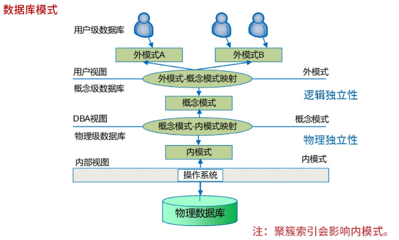

- **三级模式**

|模式名称|特点|
|---|---|
|外模式|用户模式，用以描述用户看到或使用的那部分数据的逻辑结构。(也就是sql查询语句和表)
|概念模式|是数据库中全体数据的逻辑结构和特征的描述,是所有用户的公共数据视图|
|内模式|是数据物理结构和存储方式的描述,是数据在数据库内部的表示方式,定义所有的内部记录类型、索引和文件的组织方式等。（理解成数据库引擎如innodb）

- **两级映像**

|名称|描述|特点|
|---|---|---|
|外模式-概念模式映射|指应用程序与数据库中的逻辑结构独立,<u>当数据的**逻辑结构**改变时</u>,应用程序不变|<mark>逻辑独立性</mark>|
|概念模式-内模式映射|指应用程序与磁盘中的数据互相独立。<u>当数据的**物理存储**改变时</u>,应用程序不变|<mark>物理独立性</mark>|

### 12.2.2 分布式数据库
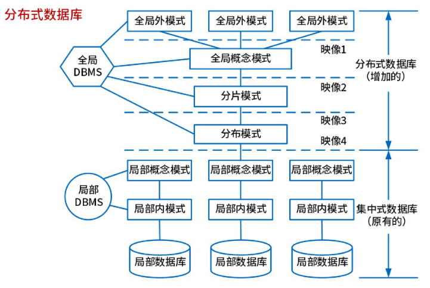

## 12.3 关系数据库 ⭐⭐⭐

### 12.3.1 基本概念 ⭐

- 属性(Attribute)

在现实世界中,要描述一个事物常常取若干特征来表示。这些特征称为属性。

- 域(Domain)

每个属性的取值范围对应一个值的集合,称为该属性的域。

- 目或度(Degree)

目或度指的是一个关系中属性的个数。

- **候选码(Candidate Key)**

若关系中的某一属性或属性组的值,能`唯一地标识一个元组`,则称该属性或属性组为候选码。

- **主码(Primary Key)**

或称主键,若一个关系有多个候选码,则选定其中一个作为主码。

- 主属性(Prime Attribute)

包含在任何候选码中的属性称为主属性。

- 外码(Foreign Key)

如果关系模式 R 中的属性或属性组不是该关系的码,但它是其他关系的码,那么该属性对关系模式 R 而言是外码。

- 全码(All-key)

关系模型的所有属性组是这个关系模式的候选码,称为全码。

### 12.3.2 关系代数 ⭐⭐⭐⭐

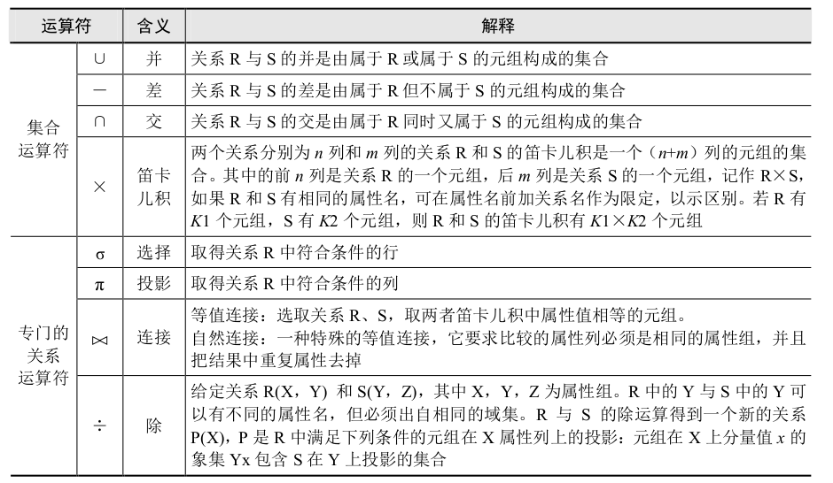

例如：

R {A,B,C,D} 和 S {C,D,E,F}

- 并 R∪S = {A,B,C,D,E,F}

R和S的所有元祖，重复的元素只保留其中一个

- 差 R-S = {A,B}   

保留R中不包含在S中的元组

- 交 R∩S = {C,D}

保留R和S中都包含的元组

- 笛卡尔积 R×S = {(A,C),(A,D),(B,C),(B,D)}

列（属性）：n+m --> 4+4=8，也就是有8列

行（元组）：K1*K2 --> 假如R有3行，S有2行，那么R×S就有6行

- 选择 σA,B,R.C,S.D  (可以理解成WHERE)

- 投影 πA,B,R.C,S.D (可以理解成SELECT)

- 连接 R⋈S = {(A,C),(B,D)}

列（属性）：n+m --> 4+2=6，也就是有6列；也就是先进行并，保留R和S中的属性，去除重复的属性

行（元组）：R和S相同列中相等的元组
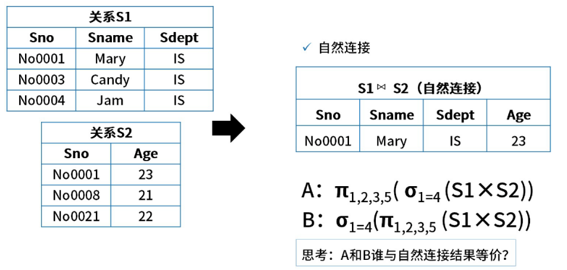

## 12.4 规范化理论 ⭐⭐⭐⭐

### 12.4.1 函数依赖 ⭐⭐

函数依赖是一种最重要、最基本的数据依赖。而关系数据库设计理论的核心就是数据间的函数依赖。

- 非平凡的函数依赖：如果 X→Y,Y⊆/X,则称 X→Y 是非平凡的函数依赖。
- 平凡的函数依赖：如果 X→Y,但 Y⊆X,则称 X→Y 是平凡的函数依赖。
- 完全函数依赖：例如,有学生关系模式(学号,系号,系主任,课程号,成绩),该关系模式的主码是学号+课程号,(学号,课程号)→成绩是完全函数依赖。

### 12.4.2 部分函数依赖 ⭐⭐ 

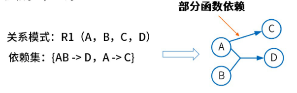

### 12.4.3 传递函数依赖 ⭐⭐

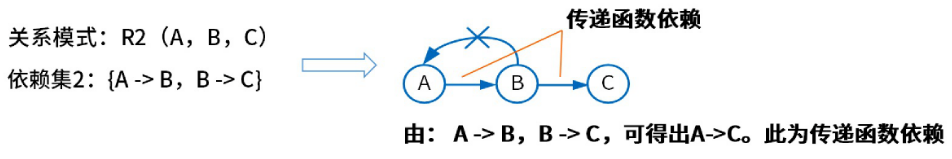

### 12.4.4 Armstrong 公理 ⭐⭐

函数依赖的公理系统(`Armstrong 公理系统`): 从已知的一些函数依赖,可以推导出另外一些函数依赖,这就需要一系列推理规则,这些规则常被称作“Armstrong 公理”。

设关系式 R(U,F),U 是关系模式 R 的属性集,F 是 U 上的一组函数依赖,则有以下三条推理规则:
- A1. **自反律**: 若 Y⊆X⊆U,则 X→Y 为 F 所蕴含。
- A2. **增广律**: 若 X→Y 为 F 所蕴含,且 Z⊆U,则 XZ→YZ 为 F 所蕴含。
- A3. **传递律**: 若 X→Y,Y→Z 为 F 所蕴含,则 X→Z 为 F 所蕴含。

根据上面三条推理规则,又可推出下面三条推理规则:
- **合并规则**: 若 X→Y,X→Z,则 X→YZ 为 F 所蕴含。
- **伪传递规则**: 若 X→Y,WY→Z,则 XW→Z 为 F 所蕴含。
- **分解规则**: 若 X→Y,Z⊆Y,则 X→Z 为 F 所蕴含。

### 12.4.5 规范化理论

规范化理论的基本思想是: 对关系模式进行分解,使得分解后的关系模式满足一定的规范化条件,从而达到数据的冗余度最小。

> 说白了，就是通过函数依赖画一个`有向图`，从第一个节点开始遍历，能够找到所有节点的，那么这个节点就被称为`候选码`。

### 12.4.6 范式 ⭐⭐⭐

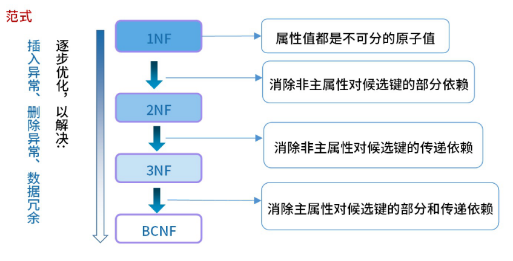

#### 12.4.6.1 1NF

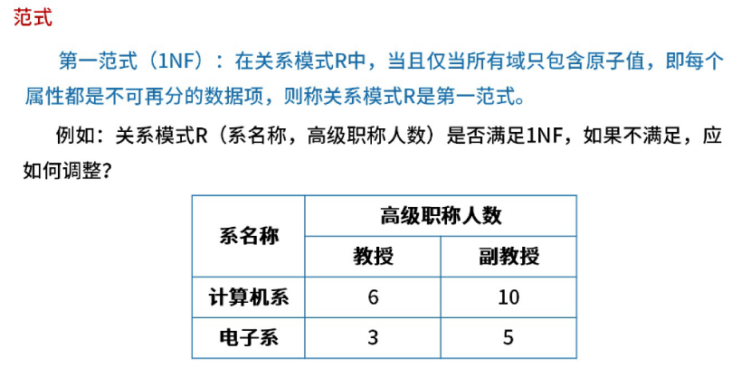

关系模式R(系名称，高级职称人数) 不符合1NF，因为高级职称人数还能继续分为教授和副教授.

#### 12.4.6.2 2NF

当且仅当实体E是第一范式，且每一个非主属性完全依赖主键（不存在部分依赖）时，则称实体E是第二范式。

例如：R(学号，课程号， 成绩， 学分) 不满足2NF，因为成绩是一个非主属性，它依赖于课程号，而不是主键。

> 可以理解为多对多。也就是一个学生可以选修多门课程，一门课程也可以被多个学生选修。这里学号唯一标识一个学生，一个学生有多门课程，因此需要拆分成两个表。R(学号，课程号) R2(课程号，成绩，学分)

>[!TIP]
>
> 2NF就是消除在一张表中存在多对一和多对多的关系

#### 12.4.6.3 3NF

在2NF基础上，消除非主属性对键的传递依赖，则称它符合3NF。

例如：R(学号，学生姓名，班级编号，院系) 不满足3NF，学生编号可以唯一确定他所在的院系，但是注意到这中间存在传递过程，即学生编号唯一确定该学生所对应的班级编号，班级编号对应唯一的院系。我们称，院系对学生编号传递函数依赖。

把院系去掉即可符合，也即R(学号，学生姓名，班级编号)

>[!TIP]
>
> 3NF就是在2NF消除在一张表中存在多对一和多对多的关系之后把多余的`冗余的列`去除掉

#### 12.4.6.4 BCNF

#### 12.4.6.5 非规范化的关系模式 ⭐

非规范化的关系模式可能存在的问题有：
- **数据冗余**: 数据冗余是指在一个关系模式中,存在多个属性或属性组的值相同的元组,这些元组的属性或属性组的值相同,但它们的主键不同。
- **更新异常**: 更新异常是指当一个关系模式中的某个元组被更新时,可能会影响到其他元组。
- **插入异常**: 插入异常是指当一个关系模式中的某个元组被插入时,可能会影响到其他元组。
- **删除异常**: 删除异常是指当一个关系模式中的某个元组被删除时,可能会影响到其他元组。

### 12.4.7 模式分解

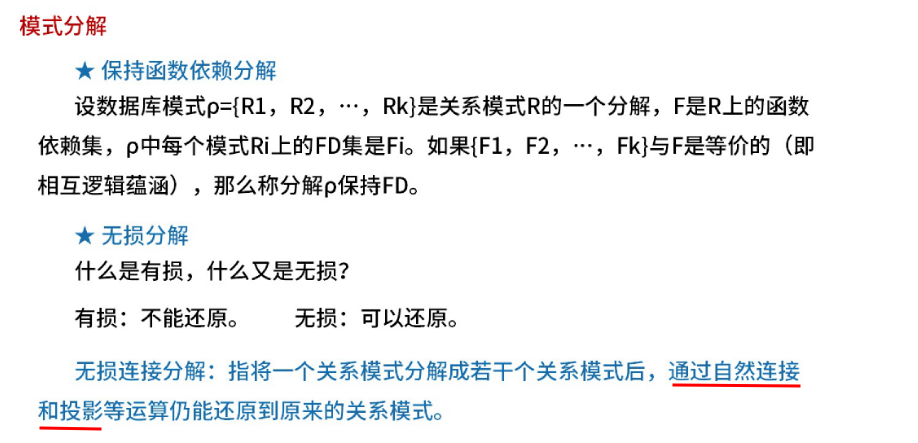

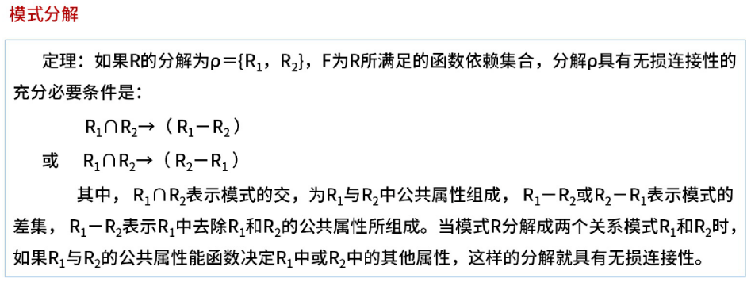

## 12.5 数据控制

### 12.5.1 事务管理

- **原子性(Atomicity)**: 事务是数据库的逻辑工作单位,事务的所有操作在数据库中要么全做,要么全都不做。
- **一致性(Consistency)**: 事务的执行使数据库从一个一致性状态变成另一个一致性状态。
- **隔离性(Isolation)**: 一个事务的执行不能被其他事务干扰。
- **持久性(Durability)**: 指一个事务一旦提交,它对数据库的改变必须是永久的,即便系统出现故障时也是如此。

### 12.5.2 并发控制

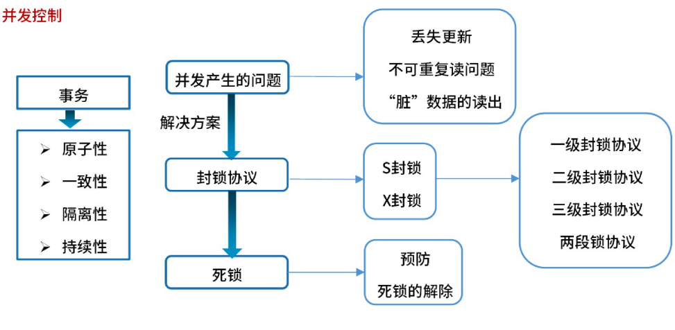

- X 锁(排他锁)： 写锁（行锁、表锁）
- S 锁(共享锁): 读写锁

### 12.5.3 故障恢复 ⭐

- 热备份：也称为动态备份，是利用数据库工具的备份功能，将数据库的状态保存到一个文件中，可以指定备份行、表数据。
- 冷备份：也称为静态备份，是将`数据库在关闭状态`下对`数据库文件`整体备份。
- 完成备份: 备份说有数据
- 差量备份: 仅备份上一次`完全备份`之后变化的数据；
- 增量备份: 备份上一次备份之后变化的数据；

## 12.6 数据库设计 ⭐⭐⭐

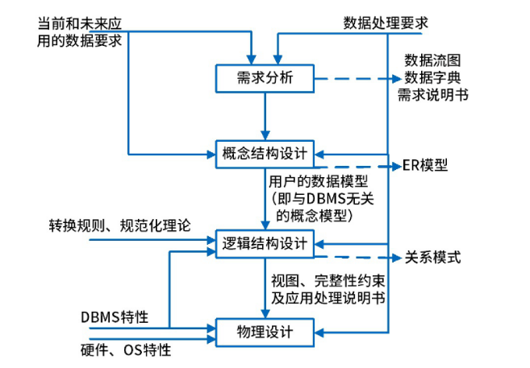

- 需求分析： 输出`数据流图`
- 概念结构设计： ER模型
- 逻辑结构设计： 关系模型
- 物理设计： 数据库
### 12.6.1 E-R模型

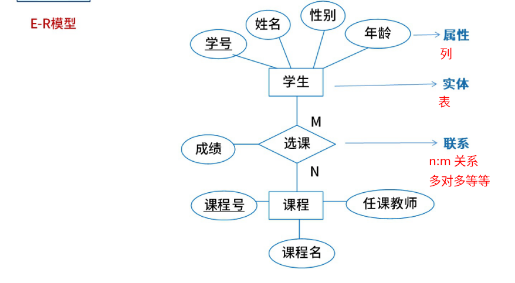

### 12.6.2 概念结构设计

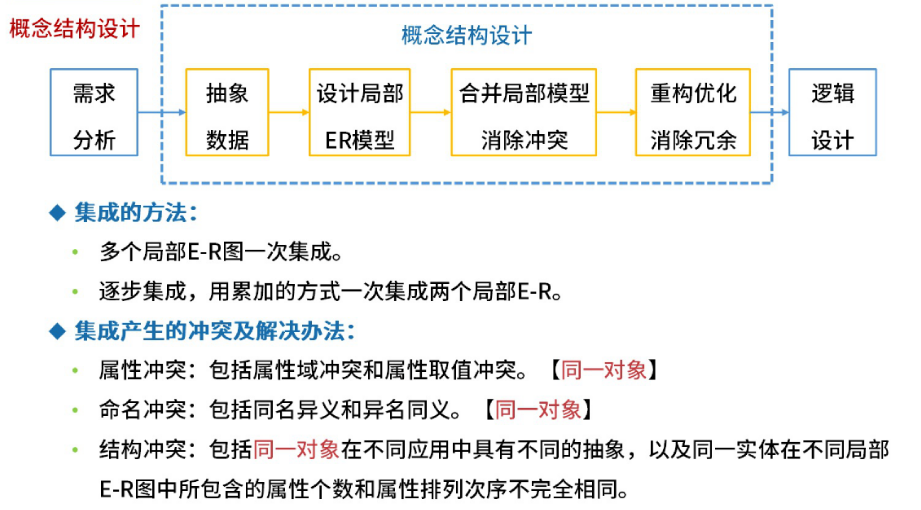

### 12.6.3 逻辑结构设计

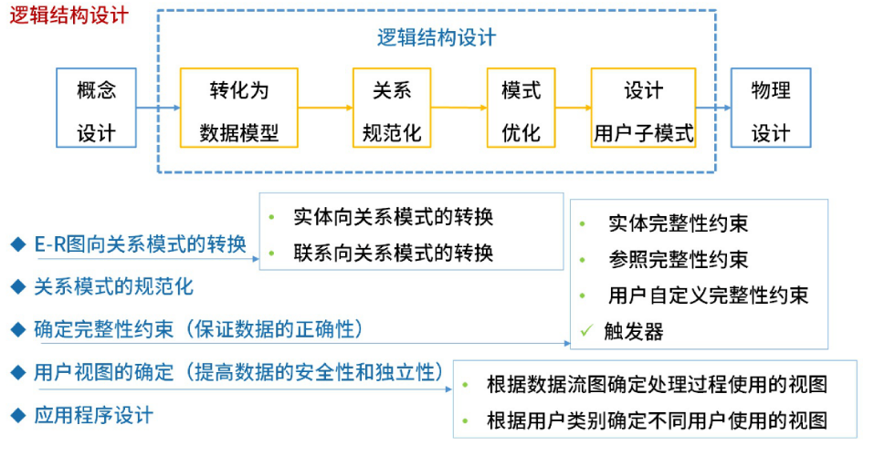

## 12.7 分布式数据库

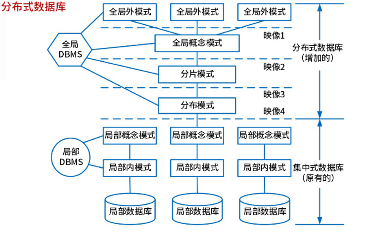

- **全局视图**: 全局视图(全局外模式)是全局应用的用户视图,是全局概念模式的子集,该层直接与用户(或应用程序)交互。
- **全局概念模式**: <u>全局概念模式定义分布式数据库中数据的整体逻辑结构,数据就如同根本没有分布一样</u>,可用传统的集中式数据库中所采用的方法进行定义

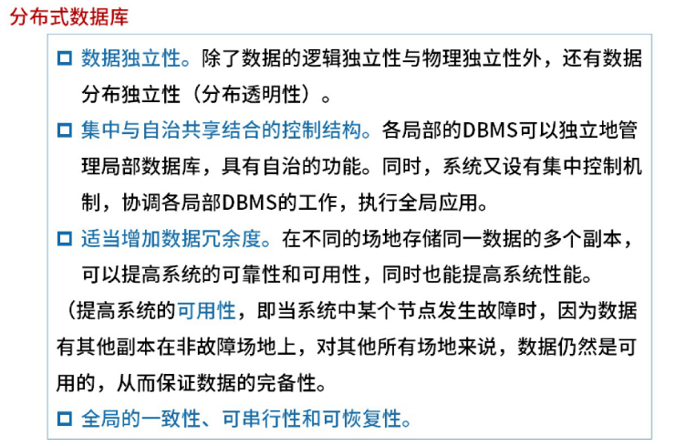

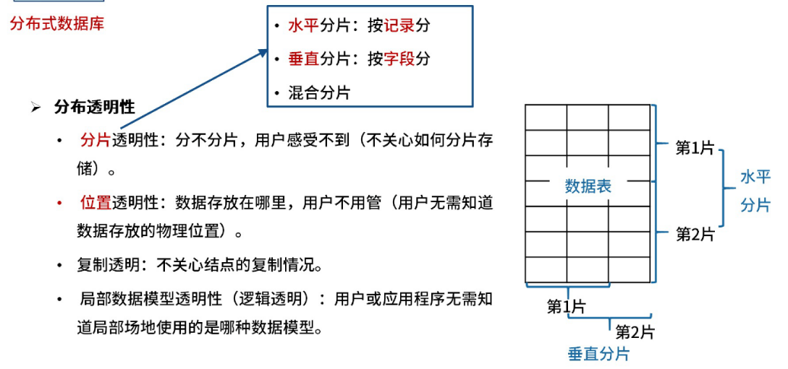

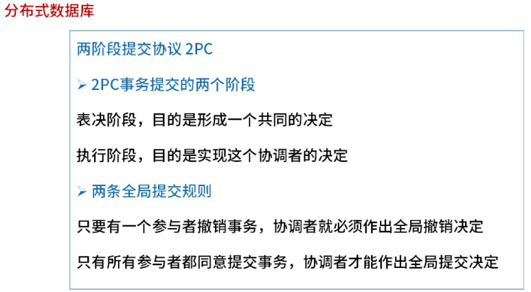

## 12.8 NOSQL数据库

NoSQL 数据库按照所使用的数据结构的类型,可分为:

- 列式存储数据库: Cattandra、HBate、Riak
- 键值对存储数据库: Redis, memcache
- 文档型数据库: mongodb
- 图数据库: Neo4J、InfoGrid、Infinite Graph

> NoSQL 特征:易扩展、大数据量、高性能、灵活的数据模型、高可用。

## 12.9 数据库优化技术

### 12.9.1 集中式数据库优化技术

集中式数据库性能优化最常见的是`反规范化设计`：

- **增加冗余列**： 增加冗余列是指在多个表中具有相同的列,它常用来在查询时避免连接操作
- **增加派生列**： 增加派生列指增加的列可以通过表中其他数据计算生成。它的作用是在查询时减少计算量,从而加快查询速度
- **重新组表**: 重新组表指如果许多用户需要查看两个表连接出来的结果数据,则把这两个表重新组成一个表来减少连接,从而提高性能
- **水平分割表**: 按记录进行分割,把数据放到多个独立的表中,主要用于表数据规模很大、表中数据相对独立或数据需要存放到多个介质上时使用
- **垂直分割表**: 对表进行分割,将主键与部分列放到一个表中,主键与其他列放到另一个表中,在查询时减少 I/O 次数

> 反规范化设计的优点是避免进行表之间的连接操作,从而可以提高数据操作的性能;缺点是会造成数据的重复存储,浪费了磁盘空间,会产生数据的不一致性问题。若要避免数据不一致的问题。可以通过设置触发器、采用事务机制(适用于单体数据库中)、应用保证(适用于异构数据库之间)以及批处理脚本的方式。

### 12.9.2 分布式数据库优化技术

- **主从复制**: 主从复制是建立一个和主数据库完全一样的数据库环境,称为从数据库。这样做的好处是:
    1. 做数据的热备。作为后备数据库,主数据库服务器故障后,可切换到从数据库继续工作,避免数据丢失。
    2. 架构的扩展。业务量越来越大,I/O 访问频率过高,单机无法满足,此时做多库的存储,降低磁盘 I/O 访问的频率,提高单个机器的 I/O 性能。
- **读写分离**: 使数据库能支持更大的并发。
- **分表**
- **分库**